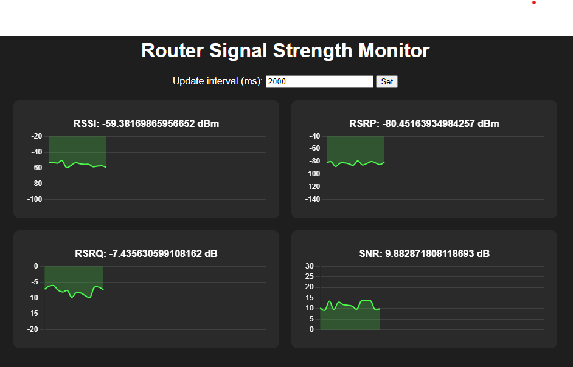
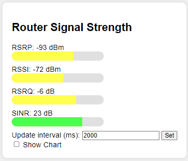

# 📡 Mobitel ZLT S12 Pro Router Signal Monitor 📊



## 📝 Description

This project provides a real-time visual monitor for the signal strength of your Mobitel ZLT S12 Pro router. It displays key metrics such as RSSI, RSRP, RSRQ, and SNR in an easy-to-read, dark-themed dashboard.

## ✨ Features

- 🔄 Real-time updates of router signal metrics
- 📊 Beautiful, responsive charts for each metric
- 🌙 Dark theme for easy viewing
- ⏱️ Customizable update interval
- 📱 Mobile-friendly design

## 🚀 Getting Started

### Prerequisites

- Google Chrome browser
- Mobitel ZLT S12 Pro router

### Installation

1. Clone this repository or download the HTML file:
git clone https://github.com/gilak11/zlt-s12-pro-signal-monitor.git
Copy2. Navigate to the project directory:
cd mobitel-zlt-s12-pro-monitor
Copy
### Running the Application

To run this application, you need to start Chrome with web security disabled. This is necessary to allow the page to make requests to your router's local IP address.

⚠️ **Warning**: Disabling web security in Chrome can pose security risks. Only use this method for local development and testing purposes.

1. Close all running instances of Google Chrome.

2. Open a command prompt or terminal.

3. Run the following command to start Chrome with web security disabled:


### For Windows:

```batch
"C:\Program Files\Google\Chrome\Application\chrome.exe" --user-data-dir="C:/ChromeDev" --disable-web-security
```

### For macOS:

```bash
open -n -a /Applications/Google\ Chrome.app/Contents/MacOS/Google\ Chrome --args --user-data-dir="/tmp/chrome_dev_test" --disable-web-security
```

### For Linux:

```bash
google-chrome --user-data-dir="/tmp/chrome_dev_test" --disable-web-security
```
4. In the Chrome window that opens, navigate to the `index.html` file in your project directory.

5. The dashboard should now load and start displaying your router's signal metrics.

## 📸 Screenshot




## 🛠️ Customization

You can customize the update interval by changing the value in the "Update interval" input field at the top of the page.

## 📄 License

This project is open source and available under the [MIT License](LICENSE).

## 🤝 Contributing

Contributions, issues, and feature requests are welcome! Feel free to check [issues page](https://github.com/gilak11/mobitel-zlt-s12-pro-monitor/issues).

## 👨‍💻 Author


- GitHub: [@gilak11](https://github.com/gilak11)


## 🙏 Acknowledgements

- [Chart.js](https://www.chartjs.org/) for the beautiful charts
- Mobitel for the ZLT S12 Pro router

## 🌟 Show your support

Give a ⭐️ if this project helped you!
